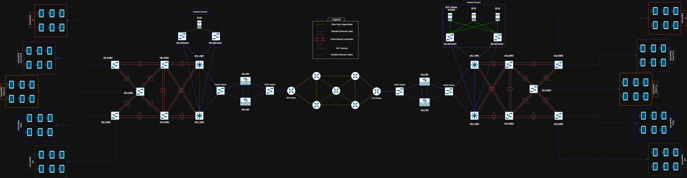

# IT8399 Cooperative Learning Project

## Enterprise Network Redesign for Multi-Branch Architecture

This repository contains the full design, configuration, and documentation for a simulated **Enterprise Network Redesign for a Multi-Branch Architecture**, built using **EVE-NG**.

The project includes two enterprise sites, an HQ site and a branch site, connected through an ISP network. It demonstrates key enterprise networking concepts such as **IPsec VPN**, **Active Directory services**, **OSPF routing**, **security controls**, and **centralized network services**.

---

## Project Overview

The goal of this project is to demonstrate a real-world enterprise infrastructure using a multi-branch network design.

The simulated network includes:

- HQ Site
- Branch Site
- ISP Network
- Centralized services
- Secure site-to-site connectivity

This project was developed as part of the **IT8399 Cooperative Learning Project** for a graduate/internship-level networking project.

---

## Key Features

- Multi-branch enterprise network architecture
- Site-to-site IPsec VPN connectivity
- OSPF dynamic routing
- Centralized services
- Active Directory integration
- IP addressing and subnetting plan
- Access Control Lists for security
- Routing and connectivity verification
- EVE-NG-based network simulation

---

## Repository Contents
**Note:** Not all project files are included in this repository due to company security and confidentiality concerns. The full configuration files, diagrams, IP addressing details, and internal documentation have been removed to protect sensitive information.

### 1. Network Configurations

This section includes the device configuration files used in the topology.

Included configuration materials:

- Full CLI configurations
- Device-specific configuration files
- Routing protocol configuration
- IPsec VPN configuration
- Security controls using Access Control Lists
- Verification commands such as:
  - `show running-config`
  - `show ip route`
  - `show crypto ipsec sa`
  - `ping`
  - `traceroute`

Devices included:

- HQ Site devices
- Branch Site devices
- ISP devices

---

### 2. Network Design Documentation

This section includes the design and planning documents for the project.

Included documentation:

- Network topology diagram
- IP addressing plan
- Network design documentation
- Routing design
- VPN design
- Security design

---

### 3. Network Topology Diagram

---

## Purpose of the Project

The purpose of this project is to demonstrate practical enterprise network design skills, including:

- Designing scalable multi-site network architecture
- Implementing OSPF routing
- Configuring secure IPsec VPN tunnels
- Planning IP addressing and subnetting
- Applying security controls using ACLs
- Integrating centralized services
- Verifying network connectivity and routing behavior

---

## Recommended Tools

To review, test, or reproduce this project, the following tools are recommended:

- **EVE-NG** for network topology simulation
- **Cisco IOSv images** for device emulation
- **Cisco ASAv images** for device emulation
- **Cisco CLI** for configuration and troubleshooting
- **Ping** and **traceroute** for connectivity testing
- **Show/debug commands** for verification

---

## How to Use This Repository

If you are studying, reviewing, or testing this project:

1. Review the network topology diagram.
2. Read the IP addressing plan.
3. Open the device configuration files.
4. Compare the configurations with the documented design.

---

## Author
Hasan Bahzad (202001980) a networking student at Bahrain Polytechnic
